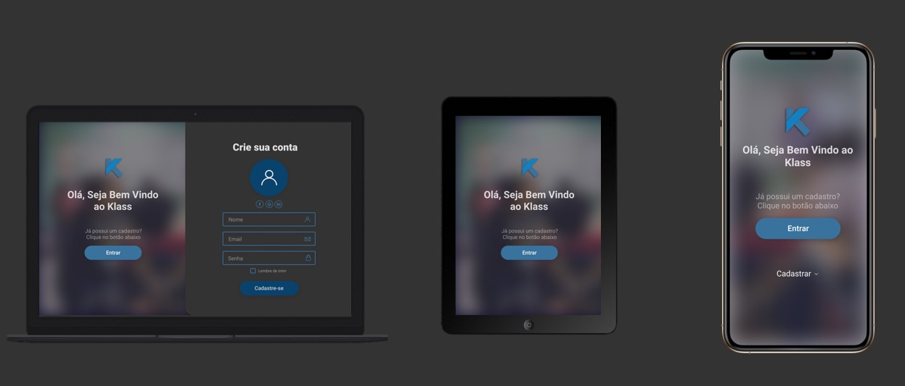

# Klass
Projeto de TCC

 

  

## 🚀 Tecnologias

Esse projeto foi desenvolvido com as seguintes tecnologias:

- [Node.js](https://nodejs.org/en/)
- [Adonis](https://adonisjs.com/)
- [React](https://reactjs.org)

## :page_with_curl: Documentação

- [Rotas API](wiki/api_routes/menu.md)
- [Fluxograma de relatório](https://whimsical.com/MMb39pfkDEyY5GAjgJ6Vpq)
- [Wireframe](https://miro.com/welcomeonboard/bN6NRyrdnNDJkCfWyxlhtATPSC5hcBnh0PE2uhhf2AGQqNu1CXEvDA9JguDIMhTT)
- [Diagrama de Caso de Uso](https://app.lucidchart.com/documents/edit/1c59bb75-d60a-4fc3-86bf-fd1142f0404e/0_0?shared=true)

## 💻 Projeto

O Klass é uma aplicação capaz de facilitar o trabalho de cordenadores, alunos e professores, automatizando a criação e divulgação de horários escolares e grades horárias.

## 🔖 Layout

Você pode visualizar o layout do projeto através [desse link](https://www.figma.com/file/mvZjbj9Y5rMXsn3zNf6vBA/TCC?node-id=0%3A1). Lembrando que você  precisa ter uma conta no [Figma](http://figma.com/) para acessá-lo.

## :memo: Licença

Esse projeto está sob a licença MIT. Veja o arquivo [LICENSE](wiki/licence/LICENCE.md) para mais detalhes.
